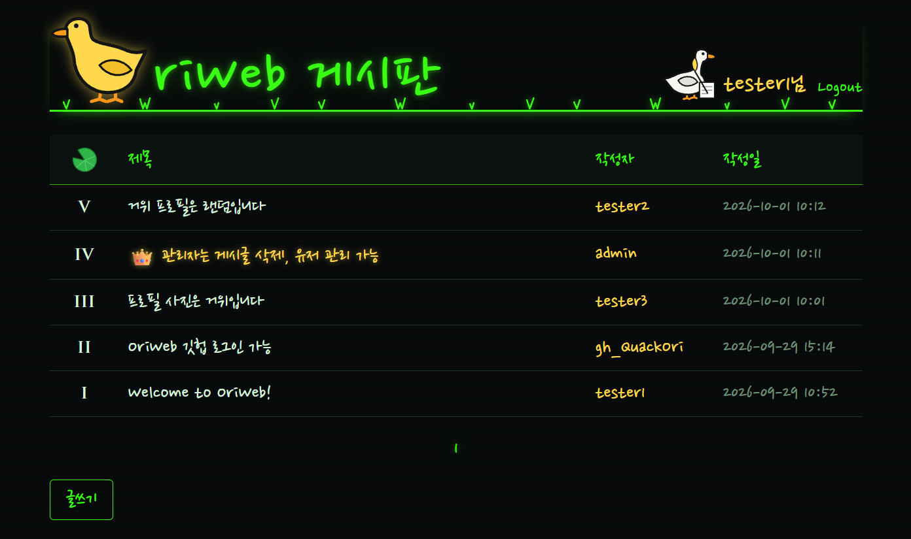

# OriWeb

> ⚠️ **교육용 의도적 취약 애플리케이션입니다.**
> 모의해킹 실습을 위해 보안 취약점을 포함하고 있습니다.
> 반드시 **로컬 환경에서만** 실행하고, 공개 서버나 인터넷에 노출된 환경에 배포하지 마세요.

<p>
   
</p>

세션 인증, 게시글(파일 업로드/다운로드 포함), 댓글 기능을 가진 간단한 게시판입니다.

## 기술 스택

| 구분 | 사용 기술 |
|---|---|
| Language | Java 21 |
| Framework | Spring Boot 3.5 (Spring Web, Spring Data JPA, Validation, Spring Security OAuth2 Client, Actuator) |
| Build | Gradle 8.14 (Gradle Wrapper 포함) |
| Database | MySQL 8.4 |
| Frontend | HTML, CSS, JavaScript (fetch API) |
| API 문서 | Swagger UI (springdoc-openapi) |
| 실행 환경 | Docker, Docker Compose |

## 실행 방법 (Docker Compose)

### 1. 사전 준비

- [Docker Desktop](https://www.docker.com/products/docker-desktop/) 설치 및 실행
- Git

### 2. 소스 받기

```bash
git clone https://github.com/QuackOri/OriWeb.git
cd OriWeb
```

### 3. 실행

```bash
docker compose up --build -d
```

처음 실행하면 이미지 다운로드와 빌드 때문에 몇 분 정도 걸립니다.
MySQL이 준비된 뒤 애플리케이션이 시작됩니다.

### 4. 접속

| 주소 | 설명 |
|---|---|
| http://localhost:8080 | 게시판 |
| http://localhost:8080/swagger-ui.html | Swagger UI (API 문서, 테스트) |
| http://localhost:8080/actuator/health | 서버 상태 확인 (Spring Boot Actuator) |

처음에는 데이터가 없으므로 회원가입 후 사용하세요.

### 5. 종료 및 관리

```bash
# 로그 확인
docker compose logs -f app

# 종료 (DB 데이터와 업로드 파일은 유지)
docker compose down

# 종료 + DB 데이터와 업로드 파일까지 모두 삭제 (초기화)
docker compose down -v
```

### GitHub 로그인 설정 (선택)

GitHub OAuth 2.0 로그인을 사용하려면 각자 GitHub OAuth App을 등록해야 합니다.
설정하지 않아도 일반 회원가입/로그인은 정상 동작하며, 로그인 화면에 GitHub 버튼만 표시되지 않습니다.

1. GitHub → **Settings → Developer settings → OAuth Apps → New OAuth App**
2. 다음 값을 입력하고 등록합니다.

   | 항목 | 값 |
   |---|---|
   | Application name | 자유 (예: OriWeb Local) |
   | Homepage URL | `http://localhost:8080` |
   | Authorization callback URL | `http://localhost:8080/login/oauth2/code/github` |

3. 등록 후 **Client ID**를 확인하고, **Generate a new client secret**으로 Client Secret을 발급합니다.
4. 프로젝트 폴더에서 `.env.example`을 복사해 `.env` 파일을 만들고 값을 입력합니다.

   ```
   GITHUB_CLIENT_ID=발급받은_Client_ID
   GITHUB_CLIENT_SECRET=발급받은_Client_Secret
   ```

5. 다시 실행합니다.

   ```bash
   docker compose up --build -d
   ```

> `.env` 파일은 `.gitignore`에 포함되어 Git에 올라가지 않습니다. Client Secret을 코드나 커밋에 넣지 마세요.

### 관리자 계정 설정 (선택)

`.env`에 관리자 아이디와 비밀번호를 넣으면, 앱이 시작될 때 해당 계정이 없으면 **관리자(ADMIN)** 로 생성합니다.

```
ADMIN_USERNAME=관리자아이디
ADMIN_PASSWORD=관리자비밀번호
```

- 아이디는 영문/숫자 4~20자, 비밀번호는 4자 이상이어야 합니다.
- 이미 일반 사용자가 쓰고 있는 아이디는 관리자로 바꾸지 않습니다. (로그에 경고 표시)
- 값을 비워 두면 관리자 계정을 만들지 않습니다.
- 관리자는 관리자 페이지(`/admin.html`)에서 사용자 목록 조회, 권한 변경, 계정 정지를 할 수 있고, 모든 게시글·댓글·첨부파일을 삭제할 수 있습니다.

### 포트와 계정 정보

| 서비스 | 컨테이너 | 포트 | 비고 |
|---|---|---|---|
| 애플리케이션 | `oriweb-app` | `127.0.0.1:8080` | |
| MySQL | `oriweb-db` | `127.0.0.1:3306` | DB `oriweb` / 계정 `oriweb` / 비밀번호 `oriweb` |

- 모든 포트는 `127.0.0.1`에만 바인딩되어 같은 PC에서만 접속할 수 있습니다.
- DB 계정은 로컬 실습용 값입니다. (`docker-compose.yml`)
- 8080 또는 3306 포트를 이미 사용 중이면 `docker-compose.yml`의 `ports` 왼쪽 값을 바꿔서 실행하세요. (예: `127.0.0.1:8081:8080`)

## 주요 기능

| 구분 | 기능 |
|---|---|
| 사용자 인증 | 회원가입, 로그인, 로그아웃 (HttpSession 기반 세션 인증, `JSESSIONID` 쿠키) |
| OAuth 2.0 | GitHub 로그인 (Spring Security OAuth2 Client, Authorization Code 방식). 처음 사용하는 GitHub 계정은 가입 확인 후 `gh_GitHub아이디`로 가입. 회원가입 페이지에서도 GitHub로 가입 가능 |
| 게시글 | 목록(페이징, 번호는 로마 숫자 순번), 상세, 작성, 수정, 삭제. 최대 3,999개 |
| 첨부파일 | 게시글에 여러 파일 업로드(파일당 최대 10MB), 원본 파일명으로 다운로드, 삭제 |
| 댓글 | 작성, 수정, 삭제 |

- 게시글 작성, 댓글 작성, 파일 업로드는 로그인이 필요합니다.
- 게시글 수정은 게시글 작성자만, 댓글 수정은 댓글 작성자만 가능합니다.
- 게시글·첨부파일 삭제는 게시글 작성자 또는 관리자, 댓글 삭제는 댓글 작성자 또는 관리자가 할 수 있습니다.
- 게시글을 삭제하면 댓글과 첨부파일도 함께 삭제됩니다.
- 목록의 번호를 로마 숫자(최대 MMMCMXCIX = 3999)로 표시하므로 게시글은 최대 3,999개까지 작성할 수 있습니다. (초과 시 `409`)
- 사용자 권한은 `USER`와 `ADMIN` 두 가지입니다. (`/api/auth/me` 응답의 `role`)
- 정지된 계정은 로그인할 수 없고, 로그인 중이던 세션도 다음 요청에서 끊깁니다. 관리자는 자기 자신의 권한 변경이나 정지를 할 수 없습니다.

## API

자세한 요청/응답 형식은 Swagger UI(http://localhost:8080/swagger-ui.html)에서 확인할 수 있습니다.

| 구분 | 메서드 | URL | 설명 | 권한 |
|---|---|---|---|---|
| Auth | POST | `/api/auth/signup` | 회원가입 | - |
| | POST | `/api/auth/login` | 로그인 (세션 생성) | - |
| | POST | `/api/auth/logout` | 로그아웃 (세션 삭제) | - |
| | GET | `/api/auth/me` | 로그인 사용자 조회 | 로그인 |
| | GET | `/api/auth/oauth-providers` | GitHub 로그인 사용 가능 여부 | - |
| OAuth | GET | `/oauth2/authorization/github` | GitHub 인증 페이지로 이동 (브라우저) | - |
| | GET | `/login/oauth2/code/github` | GitHub 인증 후 콜백 (가입된 계정이면 로그인 후 `/`, 처음이면 `/oauth-signup.html`로 이동) | - |
| | GET | `/api/auth/oauth-signup` | GitHub 가입 확인 정보 (가입될 아이디) | GitHub 인증 직후 |
| | POST | `/api/auth/oauth-signup` | GitHub 계정으로 가입 + 로그인 | GitHub 인증 직후 |
| | DELETE | `/api/auth/oauth-signup` | GitHub 가입 취소 | - |
| Post | GET | `/api/posts?page=0&size=10` | 게시글 목록 (최신순) | - |
| | GET | `/api/posts/{id}` | 게시글 상세 (첨부파일 목록 포함) | - |
| | POST | `/api/posts` | 게시글 작성 | 로그인 |
| | PUT | `/api/posts/{id}` | 게시글 수정 | 작성자 |
| | DELETE | `/api/posts/{id}` | 게시글 삭제 | 작성자, 관리자 |
| Attachment | POST | `/api/posts/{postId}/attachments` | 첨부파일 업로드 (multipart, `files`) | 게시글 작성자 |
| | GET | `/api/posts/{postId}/attachments` | 첨부파일 목록 | - |
| | GET | `/api/attachments/{id}/download` | 첨부파일 다운로드 | - |
| | DELETE | `/api/attachments/{id}` | 첨부파일 삭제 | 게시글 작성자, 관리자 |
| Comment | GET | `/api/posts/{postId}/comments` | 댓글 목록 | - |
| | POST | `/api/posts/{postId}/comments` | 댓글 작성 | 로그인 |
| | PUT | `/api/comments/{id}` | 댓글 수정 | 댓글 작성자 |
| | DELETE | `/api/comments/{id}` | 댓글 삭제 | 댓글 작성자, 관리자 |
| Admin | GET | `/api/admin/users` | 사용자 목록 | 관리자 |
| | PATCH | `/api/admin/users/{id}/role` | 권한 변경 (`{"role":"ADMIN"}`) | 관리자 |
| | PATCH | `/api/admin/users/{id}/suspension` | 계정 정지 / 해제 (`{"suspended":true}`) | 관리자 |

오류 응답은 다음 형식으로 통일되어 있습니다.

```json
{ "status": 403, "message": "게시글 작성자만 가능합니다." }
```

## 모니터링 (Spring Boot Actuator)

`health`, `info` 엔드포인트만 HTTP로 노출합니다. (`application.yml`의 `management` 설정)

| URL | 설명 |
|---|---|
| `/actuator` | 노출된 엔드포인트 목록 |
| `/actuator/health` | 애플리케이션 상태. DB 연결이 끊기면 `DOWN`(503) |
| `/actuator/health/liveness` | 프로세스가 살아 있는지 |
| `/actuator/health/readiness` | 요청을 받을 준비가 되었는지 |
| `/actuator/info` | 앱 이름, 설명, 빌드 정보(버전, 빌드 시각) |

- 상세 정보(DB, 디스크 등 구성 요소별 상태)는 외부에 표시하지 않습니다. (`show-details: never`)
- Docker Compose의 `app` 헬스 체크가 `/actuator/health`를 사용합니다. (`docker compose ps`에서 `healthy` 확인)

## 화면

| 페이지 | 주소 |
|---|---|
| 게시글 목록 | `/` |
| 로그인 | `/login.html` |
| 회원가입 | `/signup.html` |
| 게시글 상세 (첨부파일, 댓글) | `/post.html?id={id}` |
| 게시글 작성 / 수정 | `/write.html`, `/write.html?id={id}` |
| 관리자 (사용자 관리) | `/admin.html` |
| GitHub 가입 확인 | `/oauth-signup.html` |

## 데이터베이스

테이블은 애플리케이션 시작 시 JPA가 자동으로 생성합니다. (`ddl-auto: update`)

| 테이블 | 주요 컬럼 |
|---|---|
| `users` | id, username, password(BCrypt), provider, provider_id, role(USER/ADMIN), suspended, created_at |
| `posts` | id, title, content, author_id → users, created_at, updated_at |
| `comments` | id, post_id → posts, author_id → users, content, created_at, updated_at |
| `attachments` | id, post_id → posts, original_name, stored_name(UUID), size, content_type, created_at |

첨부파일은 업로드 폴더(Docker: `/app/uploads`, `upload-data` 볼륨)에 UUID 이름으로 저장되고, 원본 파일명은 DB에 저장됩니다.

## 프로젝트 구조

```
src/main/java/com/quackori/oriweb
├─ auth/         # 회원가입, 로그인, 로그아웃, 세션, Spring Security 설정
│  └─ oauth/     # GitHub OAuth 2.0 로그인 처리
├─ user/         # 사용자 엔티티
├─ post/         # 게시글
├─ attachment/   # 첨부파일 업로드/다운로드, 파일 저장소
├─ comment/      # 댓글
├─ admin/        # 관리자: 사용자 목록, 권한 변경, 계정 정지
└─ common/       # 공통 예외 처리, 페이지 응답
src/main/resources
├─ application.yml
└─ static/       # 화면 (HTML, CSS, JS)
```

## 로컬 개발

IntelliJ 등에서 애플리케이션을 직접 실행하려면 JDK 21이 필요합니다.

```bash
# DB만 Docker로 실행
docker compose up -d db

# 애플리케이션 실행 (Windows는 gradlew.bat)
./gradlew bootRun
```

로컬 실행 시 업로드 파일은 프로젝트 폴더의 `uploads/`에 저장됩니다.

### 테스트

```bash
./gradlew test
```

JDK 없이 Docker로 실행하려면 (프로젝트 폴더에서):

```bash
docker run --rm -v "$PWD":/workspace -w /workspace eclipse-temurin:21-jdk ./gradlew test --no-daemon
```
